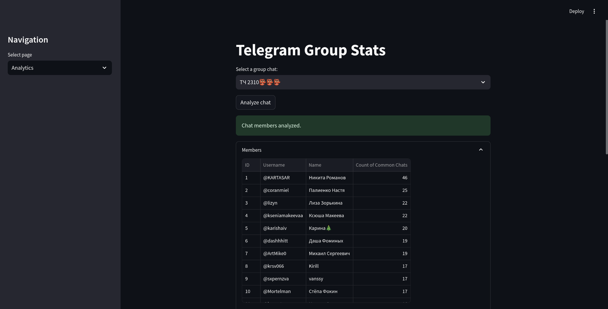
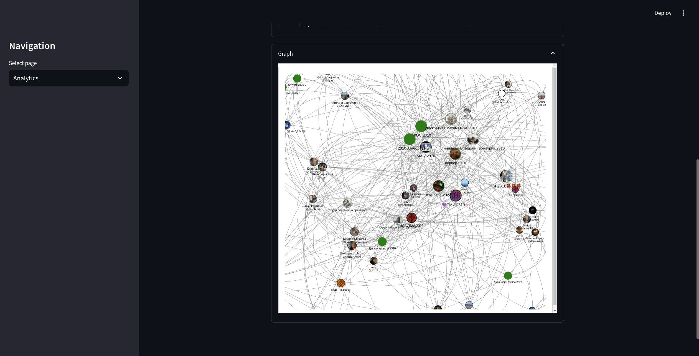

# Telegram Group Stats




**Telegram Group Stats** is a powerful tool designed to extract and analyze information from your Telegram groups using TDLib (Telegram Database Library). It offers comprehensive insights into user memberships, common groups among users, and visual analytics through an intuitive Streamlit interface.

## Table of Contents

- [Features](#features)
- [Demo](#demo)
- [Installation](#installation)
  - [Prerequisites](#prerequisites)
  - [Setup TDLib](#setup-tdlib)
  - [Environment Configuration](#environment-configuration)
  - [Docker Setup](#docker-setup)
- [Usage](#usage)
- [Testing](#testing)
- [Development](#development)
- [License](#license)
- [Contact](#contact)

## Features

- **Telegram Integration:** Seamlessly connect and authorize your Telegram account using TDLib.
- **Group Management:** Fetch and display all your Telegram groups, including supergroups and channels.
- **Member Analysis:** Retrieve detailed member lists from selected groups.
- **Common Groups Analysis:** Identify and count the number of groups shared between users.
- **Interactive Analytics:** Visualize data through interactive graphs and detailed statistics using Streamlit.
- **Comprehensive Testing:** Ensure reliability with a suite of unit tests.
- **Docker Support:** Easy deployment using Docker and Docker Compose.
- **Extensible Architecture:** Modular design allowing for future enhancements and feature additions.

## Demo

Check out our [Video Demo](https://drive.google.com/file/d/1bnfRz6lTo-szwSJitRH16emSjPoy-fiH/view?usp=sharing) to see Telegram Group Stats in action.

## Installation

### Prerequisites

- **Operating System:** Linux-based system recommended.
- **Dependencies:**
  - `cmake`, `g++`, `zlib1g-dev`, `libssl-dev`, `gperf`, `make`, `git`
  - **Python:** Version 3.11+
  - **Poetry:** For dependency management
- **Docker:** (Optional, for containerized setup)

### Setup TDLib

1. **Install Build Dependencies:**

    ```bash
    sudo apt-get update && sudo apt-get upgrade -y
    sudo apt-get install -y make git zlib1g-dev libssl-dev gperf cmake g++
    ```

2. **Clone and Build TDLib:**

    ```bash
    git clone https://github.com/tdlib/td.git
    cd td
    mkdir build && cd build
    cmake -DCMAKE_BUILD_TYPE=Release ..
    cmake --build .
    cd ../../
    cp ./td/build/libtdjson.so.1.8.40 ./libtdjson.so
    ```

### Environment Configuration

1. **Clone the Repository:**

    ```bash
    git clone https://github.com/werserk/telegram_group_stats.git
    cd telegram_group_stats
    ```

2. **Set Up Environment Variables:**

    Copy the example environment file and fill in your `API_ID` and `API_HASH`:

    ```bash
    cp example.env .env
    ```

    Edit the `.env` file:

    ```env
    API_ID=your_api_id_here
    API_HASH=your_api_hash_here
    DATABASE_DIR=tdlib
    TDLIB_LOGGING_LEVEL=2
    ```

### Docker Setup

1. **Build and Run with Docker Compose:**

    Ensure Docker and Docker Compose are installed on your system.

    ```bash
    docker-compose up --build
    ```

2. **Access the Application:**

    Open your browser and navigate to [http://localhost:8501](http://localhost:8501) to interact with the Streamlit app.

## Usage

1. **Authorization:**

    - Navigate to the **Authorization** page via the sidebar.
    - Enter your Telegram phone number and follow the prompts to authorize the application.

2. **Analytics:**

    - Once authorized, switch to the **Analytics** page.
    - Select a group chat to analyze its members.
    - Click on **Analyze chat** to generate statistics.
    - View detailed member information and interactive graphs visualizing group relationships.

## Testing

Ensure the application functions correctly by running the provided test suite.

1. **Install Dependencies:**

    ```bash
    poetry install
    ```

2. **Run Tests:**

    ```bash
    pytest
    ```

    The tests cover authentication flows, service interactions, and analytics functionalities to ensure robustness.

### Test Cases

Key test cases implemented include:

- **test_auth_page_shows_phone_input:** Verifies that the phone input is displayed during the phone number authorization step.
- **test_auth_page_no_auth_state:** Ensures that a success message is shown when the authorization state is READY.
- **test_get_my_user_id:** Confirms that the service correctly retrieves the current user's ID.
- **test_get_chats_empty:** Checks that `get_chats` returns an empty list when there are no chats.
- **test_get_chats_success:** Validates that `get_chats` successfully fetches and lists group chats.
- **test_get_chat_members_basic:** Tests that `get_chat_members` retrieves members from a basic group correctly.
- **test_set_verbosity_level:** Ensures that the verbosity level is set correctly.
- **test_set_verbosity_level_multiple_calls:** Checks that multiple verbosity level settings are handled properly.
- **test_is_authorized:** Verifies that `is_authorized` returns True when authorized.
- **test_send:** Confirms that the `send` method transmits the correct data.
- **test_receive:** Validates that the `receive` method retrieves the expected data.
- **test_execute:** Tests that the `execute` method sends a query and returns the correct response.
- **test_login_step_changes_state:** Ensures that `login_step` updates the authorization state appropriately.
- **test_login_step_no_state_change:** Confirms that `login_step` does not change state when there are no updates.
- **test_analytics_page_show_chats:** Verifies that `AnalyticsPage.show` displays chats and populates statistics.

## Development

### Prerequisites

- **Operating System:** Linux-based system
- **Tools:** `cmake`, `g++`, `zlib1g-dev`, `libssl-dev`, `gperf`, `make`, `git`
- **Python:** Version 3.11+
- **Poetry:** For dependency management

### Setting Up the Development Environment

1. **Clone the Repository:**

    ```bash
    git clone https://github.com/werserk/telegram_group_stats.git
    cd telegram_group_stats
    ```

2. **Set Up Poetry Environment:**

    ```bash
    poetry install
    poetry shell
    ```

3. **Build TDLib (if not already done):**

    Follow the [Setup TDLib](#setup-tdlib) instructions above.

### Code Structure

```
.
├── app
│ ├── init.py
│ ├── constants.py
│ ├── telegram
│ │ ├── init.py
│ │ ├── client.py
│ │ ├── functional.py
│ │ └── service.py
│ └── web
│   ├── init.py
│   ├── analytics.py
│   ├── auth.py
│   └── graph.py
├── assets
│ └── images
│   ├── telegram.png
│   ├── img.png
│   └── img_1.png
├── docker-compose.yaml
├── Dockerfile
├── example.env
├── libtdjson.so
├── main.py
├── poetry.lock
├── pyproject.toml
├── README.md
└── tests
  ├── __init__.py
  ├── conftest.py
  ├── test_analytics.py
  ├── test_auth.py
  ├── test_client.py
  └── test_service.py
```

### Linters and Code Quality

Maintain code quality using the following tools:

- **Black:** Code formatter
- **Flake8:** Linting
- **isort:** Import sorter
- **Mypy:** Type checker

Refer to `pyproject.toml` for configuration details.

## License

This project is licensed under the [MIT License](LICENSE).

## Contact

- **GitHub:** [https://github.com/werserk/telegram_group_stats](https://github.com/werserk/telegram_group_stats)
- **Telegram:** [@werserk](https://t.me/werserk)

---
*Made with ❤️ by [werserk](https://github.com/werserk)*
